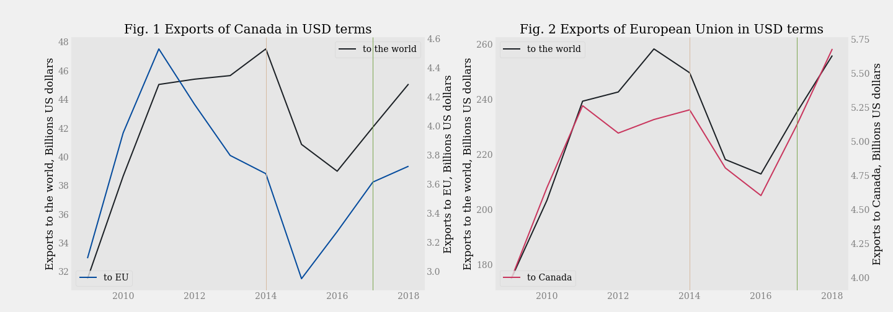

# The economic effect of the CETA on EU and Canada: a comparative analysis

The study project analyses the effects of the Comprehensive Economic and Trade Agreement between Canada and the EU. 
The project examines the trade in goods: absolute changes, shares in imports and exports and growth rates, as well as absolute changes in capital stocks.
I've used open data from Canada Statistics, OECD, and Trade Map by International Trade Center. 
I've imported and cleaned data using Pandas, visualized the data, and style the plots with Matplotlib. 

